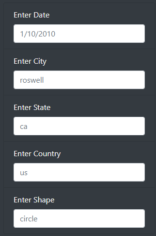
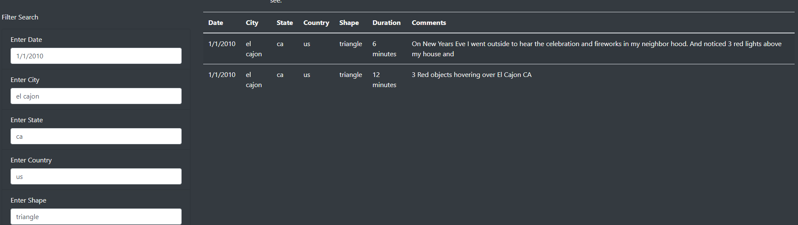

# UFOs

## Project Overview

This project is to create an intractive webpage to provide an analysis of UFO sighting by allowing users to filter for multiple critera at the same time.

## Results:

- The filters include dates , city, state, country and shape of the UFO object.  
- There is a navigation bar called " UFO Sightings" to reset the filters back to their 
- A Table object has been used to display the rows and columns from our data file
- The webpage will be updated with the search criteria after pressing Enter.  

## Summary:

One of the drawbacks of this webpage is not validating the input. For example if we type US instead of us , we will get no result. Also the page spave is not used efficiently. For example there is unused space above and under search criterias and by scrolling down we lose the view of criterias. Also in order to update or reset them we need to scroll up all the way to the top of the page. Also the search criterias do

### Recomendations:

- Add more interactive features when typing invalidated data by prompting a message. 
- Remove case sensitivity for text inputs. 
- Add 'from Date' and 'to date' criterias to specefiy a time range search
- Fix the search area and UFO Sightings on the page to access all the time or add a 'Top' botton to return to top of the page
- Change the 'shape' search from a text entry to a drop down menu

